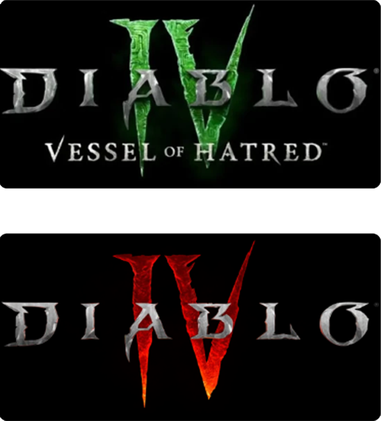

<h1>Shipped Titles</h1>

  
  

    

        <h3><a class="project-links" href="https://diablo4.blizzard.com/en-us/vessel-of-hatred">Diablo IV: Vessel of Hatred</a></h3>
        October 2024
    

    

        
The first Diablo IV Expansion

    

    

      <h3><a class="project-links" href="https://diablo4.blizzard.com/en-us/">Diablo IV</a></h3>
      June 2023
    

    

      
I collaborated with many art disciplines to deliver key graphics features and workflow improvements:

      <ul>
          <li>Designed a VFX recoloring systlem, in collaboration with gameplay engineers and designers, to optimize power design workflow</li>
          <li>Co-implemented GTAO with another engineer to upgrade our AO system (Read more <a class="project-links" href="https://news.blizzard.com/en-us/article/24077218/hells-beauty-burns-anew-with-ray-tracing">here!</a>)</li>
          <li>Integrated the <a href="https://gpuopen.com/fidelityfx-denoiser/" class="project-links">FidelityFX Shadow Denoiser</a> to boost raytracing performance and quality</li>
      </ul>
    

  

  
  

    

      <h3><a class="project-links" href="https://diablo4.blizzard.com/en-us/">Diablo II: Resurrected</a></h3>
      September 2021
    

    

      

          I collaborated mainly with VFX artists to develop shaders and provide support for the <a href="https://www.popcornfx.com/" class="project-links">PopcornFX editor</a>.
      

      <ul>
          <li>Maintained and integrated the PopcornFX SDK upgrades into the engine</li>
          <li>Optimized various VFX memory and performance</li>
      </ul>
    

  

<section class="portfolio-preview">
  

    <h1>Portfolio</h1>
    <a class="project-links" href="/portfolio">View all projects</a>
  

  

    
      <!-- show only 4 items -->
      

        <a href="{{ item.url }}" class="project-links">
          
          <h4>{{ item.title }}</h4>
        </a>
      

    
  

</section>

